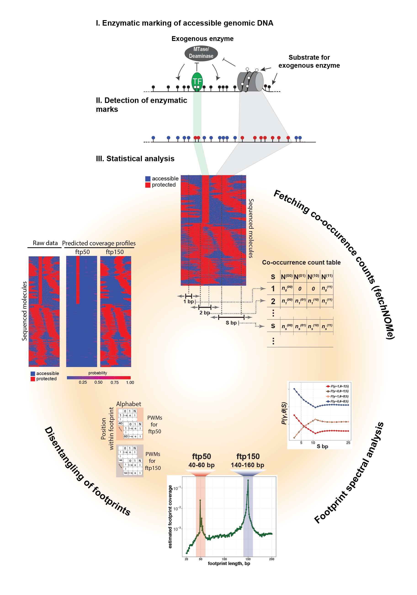
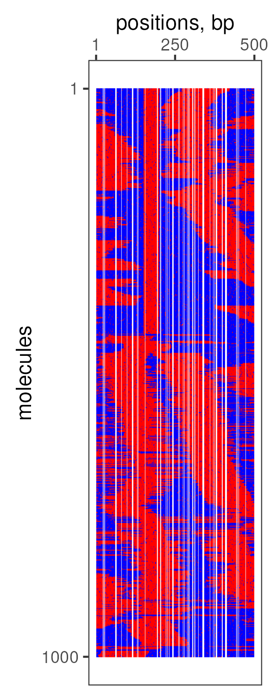
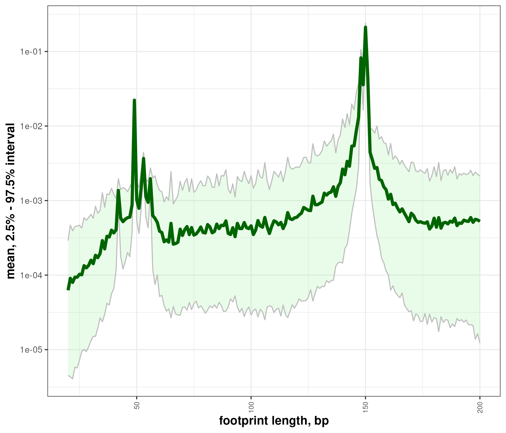
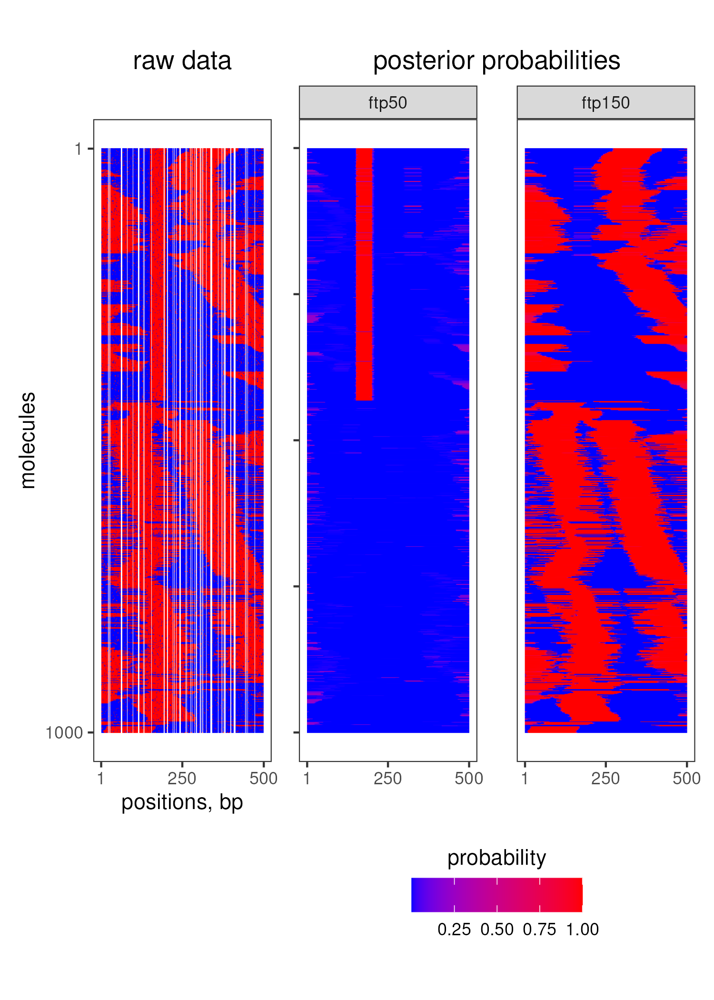

<!-- README.md is generated from README.Rmd. Please edit that file -->

```{r, include = FALSE}
knitr::opts_chunk$set(
  collapse = TRUE,
  comment = "#>",
  fig.path = "man/figures/README-",
  out.width = "100%"
)
```

<!-- badges: start -->
[](https://github.com/fmi-basel/compbio-nomeR/actions/workflows/R-CMD-check.yaml)
<!-- badges: end -->


## Overview

nomeR is an R package that implements a novel statistical framework for the analysis of single-molecule footprinting (SMF) datasets.
The statistical approach addresses two major analytical challenges in SMF data:

1. Footprint Spectral Analysis
This component identifies and quantifies different classes of footprints and estimates background noise in both accessible and protected regions. It provides insight into the abundance and heterogeneity of footprints in the dataset.


2. Footprint Prediction
Given the user-defined lengths, abundances, and noise levels of footprints, the second part of the model assigns probabilities to each footprint for covering (or starting from) every position within a molecule, effectively disentangling footprints of different lengths and accurately mapping their spatial organization.


<p align="center">
  
</p>

<!--  -->
<!--  -->


## Installation


You can install the development version of nomeR from [GitHub](https://github.com/) with:

``` r
# install.packages("devtools")
devtools::install_github("fmi-basel/compbio-nomeR")
```


## Requirements

 - Footprint Spectral Analysis
   * Count table with co-occurences of pairs 00, 01, 10, 11 (where 0-accesible state, 1-protected state) at different distances. This table can be fetched using function `get_ctable_from_bams` from the R package fetchNOMe.
 - Footprint Disentangling
   * A matrix containing accessibility information for each position and molecule, where rows represent molecules and columns positions within ROI. The following encoding must be followed: 0-accesible state, 1-protected state. This matrix can be obtained using function `get_data_matrix_from_bams` from the R package fetchNOMe.
   * Alternatively, a list of vectors containing accessibility information for every molecule. This list can be obtained using function `get_molecule_data_list_from_bams` from the R package fetchNOMe.


## Example


``` r
library(nomeR)
library(ggh4x)
library(ggrastr)
library(tidyverse)
library(reshape2)
library(patchwork)

# Load matrix with accessibilie information. Columns are positions within ROI and rows are molecules. 0 - accessible, 1 - protected
rdatmat <- readRDS(file = system.file("extdata", "insilico_data_mat.rds", package = "nomeR"))

# plot data
melt(rdatmat,varnames  = c("readid","pos"), value.name = "data",na.rm=T) %>%
	ggplot(aes(x=pos-5000,y=readid,fill=factor(data)))+
	force_panelsizes(rows=unit(4.5,"in"),
									 cols = unit(1.25,"in"))+
	geom_tile_rast()+
	scale_fill_manual(values = c("0"="blue","1" = "red"))+
	scale_x_continuous(breaks = c(1,250,500),position = "top")+
	scale_y_reverse(breaks =c(1,1000))+
	theme_bw()+
	labs(x="positions, bp",y="molecules")+
	theme(panel.grid = element_blank(),
				panel.spacing.x = unit(7,"mm"),legend.position = "none")
				
```

<p align="center">
  
</p>


``` r
				
## obtain co-occurrence counts
ctbl <- get_ctable_from_matrix(rdatmat,
															 max_spacing = 200)

## footprint spectral analysis
ftpspec <- infer_footprints_vb(cooc_ctable = ctbl,
															 ftp_lengths = 20:200,
															 output_samples = 4000,
															 iter= 5000,
															 grad_samples = 1,
															 tol_rel_obj = 1e-7,
															 algorithm = "meanfield",
															 max_nruns = 5)
															 
## get inferred parameters and plot footprint spectrum
ftpsummr <- get_ftp_inference_summary(ftpspec,plot=T,show_plot = T)

```

<p align="center">
  
</p>


``` r
## select footprints for prediction
ftp_suggest <- rbind("ftp50" = c(40,60),
										 "ftp150" = c(140,160))

## create footprint models (PWMs)										 
ftpsummr$FTP_SUGGEST <- ftp_suggest
ftp_models <- get_ftp_models_for_prediction(ftpsummr)

## calculate posterior probabilities for each footprint
ftp_prediction <- predict_footprints(data=rdatmat,
																		 footprint_models = ftp_models$FTP_MODELS,
																		 bgprotectprob = ftp_models$bgprotectprob,
																		 bgcoverprior = ftp_models$bgcoverprior,
																		 ncpu = 20)
## aggregate probabilities for ftp50 and ftp150
merge_footprints <- function(predict_df,
														 ftp_patterns = c("ftp1","ftp2","ftp3")){
	aggr_ftp_probs <- do.call(cbind,sapply(ftp_patterns,
																				 function(ftppat){

																				 	rowSums(x = predict_df[,grep(pattern = paste0(ftppat,"(\\.\\.)?"),
																				 															 x = colnames(predict_df),perl=T),drop=F])
																				 }, simplify = F,USE.NAMES = T))
	outdf <- cbind(predict_df[,c("seq","pos")],
								 aggr_ftp_probs)
	return(outdf)
}

ftp_cover <- merge_footprints(ftp_prediction$COVER_PROB,ftp_patterns = c("ftp50","ftp150"))

## plot raw data and prediction
predpl <- ggplot(ftp_cover,aes(x=pos,y=as.integer(seq),fill=prob))+
	facet_wrap2(~ftp,nrow=1)+
	force_panelsizes(rows=unit(4.5,"in"),
									 cols = unit(1.25,"in"))+
	geom_tile_rast()+
	scale_fill_gradientn(colours = c("blue","red"),values = c(0,1),
											 guide = guide_colorbar(title="probability"))+
	scale_x_continuous(breaks = c(1,250,500))+
	scale_y_reverse()+
	labs(title="posterior probabilities")+
	theme_bw()+
	theme(axis.title = element_blank(),
				axis.text.y = element_blank(),
				panel.grid = element_blank(),
				panel.spacing.x = unit(7,"mm"),
				plot.title = element_text(hjust=0.5),
				legend.position = "bottom",
				legend.title.position = "top",
				legend.title = element_text(hjust=0.5))
rw_data  <-melt(rdatmat,varnames  = c("readid","pos"), value.name = "data",na.rm=T) %>%
	ggplot(aes(x=pos-5000,y=readid,fill=factor(data)))+
	force_panelsizes(rows=unit(4.5,"in"),
									 cols = unit(1.25,"in"))+
	geom_tile_rast()+
	scale_fill_manual(values = c("0"="blue","1" = "red"))+
	scale_x_continuous(breaks = c(1,250,500),position = "bottom")+
	scale_y_reverse(breaks =c(1,1000))+
	theme_bw()+
	labs(x="positions, bp",y="molecules",title="raw data")+
	theme(panel.grid = element_blank(),
				panel.spacing.x = unit(7,"mm"),legend.position = "none",
				plot.title = element_text(hjust=0.5))

rw_data + predpl + plot_layout(nrow=1)


```
<p align="center">
  
</p>
